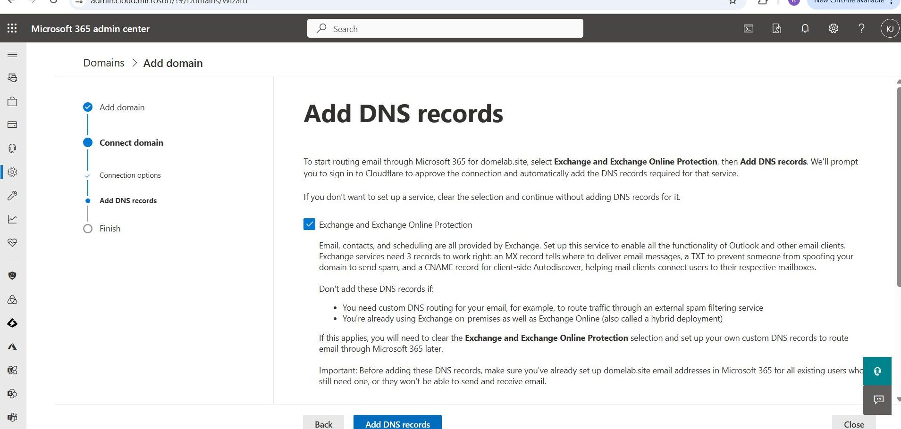
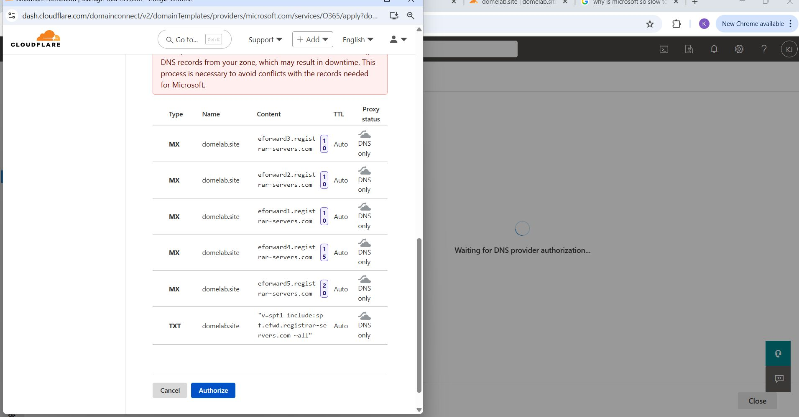
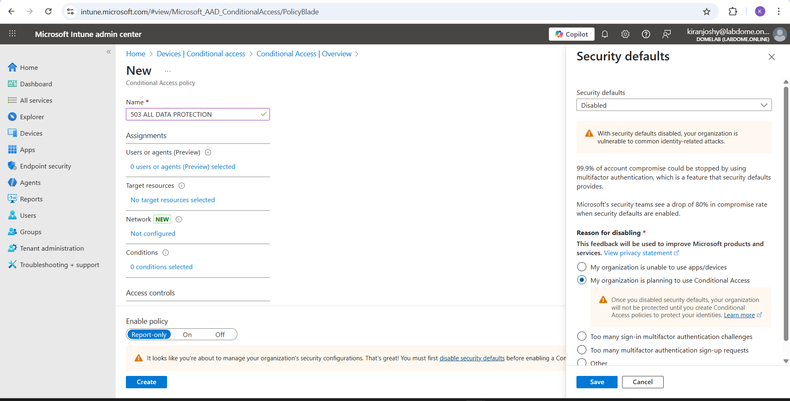

# 📘 Project 01 — Cloud-Centric Security Lab with SOC Integration

---

## Project Overview

This project documents my **hands-on experience designing, securing, monitoring, and automating a cloud-centric enterprise environment** using Microsoft security technologies and Infrastructure as Code (IaC).

The lab was intentionally designed to mirror how **real-world organizations operate a Security Operations Center (SOC)**, with a strong emphasis on:

- Identity-first and Zero Trust security
- Endpoint, email, and SaaS protection
- Centralized logging and visibility
- Threat detection and investigation
- Automated incident response (SOAR)

Rather than listing configurations alone, this project focuses on:

- **Why** each security control exists  
- **How** Microsoft security services integrate end-to-end  
- **How** attacks are detected, enriched, visualized, and automatically contained  

This reflects structured learning, deliberate design decisions, and operational thinking aligned with **SOC Analyst, Cloud Security, and Junior Security Engineer roles**.

---

## Key Outcomes

- Deployed Microsoft Sentinel and Log Analytics using **Terraform (IaC)**
- Centralized identity, endpoint, email, and cloud telemetry
- Detected real-world **RDP brute-force attacks** (Event ID 4625)
- Enriched logs with **GeoIP intelligence** and visualized attacker locations
- Automated incident containment using **SOAR (Logic Apps + Runbooks)**

---

## Technologies Used

- **Cloud Platform:** Microsoft Azure  
- **Identity & Access Management:** Microsoft Entra ID (Azure AD)  
- **Device Management:** Microsoft Intune (Windows & Android)  
- **Threat Protection:** Microsoft Defender Suite  
- **SIEM / SOAR:** Microsoft Sentinel  
- **Infrastructure as Code:** Terraform (GitHub + Terraform Cloud)  
- **DNS & Zero Trust Foundation:** Cloudflare  

---

## Lab Completion Checklist

- [x] Custom domain and DNS configuration  
- [x] Secure Microsoft 365 tenant setup  
- [x] Automated licensing and dynamic groups  
- [x] Windows Autopilot onboarding  
- [x] CIS-aligned endpoint security baselines  
- [x] Endpoint Detection & Response (EDR/XDR)  
- [x] Mobile security (Android BYOD)  
- [x] Email and SaaS protection  
- [x] Conditional Access (Zero Trust)  
- [x] SIEM, SOAR, and automated incident response  

---

## Implementation Journey

---

## Step 1: Domain Purchase & DNS Foundation (Cloudflare)

### 🔍 Overview
Established a secure DNS foundation to support identity, email, and Zero Trust services.

### 🛠️ What I Did
- Purchased a custom domain
- Transferred DNS management to Cloudflare
- Verified nameserver propagation

### 📚 What I Learned
- DNS is foundational to cloud identity and email security
- Why Cloudflare is commonly used in Zero Trust architectures

### 🧠 Skills Demonstrated
- DNS configuration
- Third-party integration

.jpg)

---

## Step 2: Microsoft 365 Tenant Setup & Custom Domain Integration

### 🔍 Overview
Created a secure Microsoft 365 tenant and integrated the custom domain.

### 🛠️ What I Did
- Created tenant using `onmicrosoft.com`
- Enforced MFA for administrative accounts
- Verified custom domain ownership
- Configured Exchange, SharePoint, Teams, and Intune DNS records

### 📚 What I Learned
- Microsoft 365 identity and tenant architecture
- Importance of securing admin access from day one

### 🧠 Skills Demonstrated
- Entra ID administration
- MFA enforcement
- Microsoft 365 DNS configuration

---

## Step 3: Licensing Strategy & Security Feature Enablement

### 🔍 Overview
Enabled enterprise security capabilities through proper licensing.

### 🛠️ What I Did
Activated trial licenses:
- EMS E5  
- Defender for Endpoint P2  
- Defender for Office 365 P2  
- Microsoft 365 Business Premium  

### 📚 What I Learned
- Licensing directly impacts security posture
- Security requirements should drive license selection

### 🧠 Skills Demonstrated
- License planning
- Security enablement

%20-%20Copy.png)

---

## Step 4: Dynamic Groups, Auto-Licensing & Break-Glass Admin

### 🔍 Overview
Automated identity management while ensuring emergency access.

### 🛠️ What I Did
- Created dynamic user and device groups
- Automated license assignment
- Created break-glass Global Admin excluded from Conditional Access

### 📚 What I Learned
- Automation improves scalability and consistency
- Emergency access is a critical security best practice

### 🧠 Skills Demonstrated
- Identity automation
- Group-based access control

%20-%20Copy.jpg)

---

## Step 5: Intune Enrollment & Windows Autopilot Configuration

### 🔍 Overview
Secured endpoints from first boot using Intune and Autopilot.

### 🛠️ What I Did
- Enabled automatic Intune enrollment
- Created Autopilot deployment profile
- Validated compliance and policy application

### 📚 What I Learned
- Device security begins at enrollment
- Licensing impacts endpoint workflows

### 🧠 Skills Demonstrated
- Endpoint provisioning
- Windows Autopilot

%20-%20Copy.jpg)
.png)

---

## Step 6: CIS Security Baselines & Endpoint Hardening

### 🔍 Overview
Hardened endpoints using CIS-aligned security baselines.

### 🛠️ What I Did
- Deployed antivirus, firewall, encryption, ASR, and compliance policies

### 📚 What I Learned
- Baselines reduce configuration drift
- Differences between user and device enforcement

### 🧠 Skills Demonstrated
- Endpoint hardening
- Policy management

%20-%20Copy.jpg)

---

## Step 7: Defender for Endpoint & XDR Integration

### 🔍 Overview
Enabled endpoint detection and response and validated XDR telemetry.

### 🛠️ What I Did
- Integrated Defender for Endpoint with Intune
- Enabled EDR, tamper protection, and live response
- Verified endpoint protection status

### 📚 What I Learned
- Endpoint telemetry strengthens XDR investigations
- How Intune and Defender integrate for enforcement and visibility

### 🧠 Skills Demonstrated
- Endpoint security
- Security tool integration

%20-%20Copy.jpg)
%20-%20Copy.jpg)

---

## Step 8: Mobile Security — Android Enterprise (BYOD)

### 🔍 Overview
Implemented BYOD security using Android Enterprise and app protection.

### 🛠️ What I Did
- Configured Android Enterprise and Managed Google Play
- Created app protection and compliance policies
- Enforced Conditional Access
- Tested onboarding using Company Portal

### 📚 What I Learned
- BYOD risks and mitigation strategies
- Difference between device management and app protection

### 🧠 Skills Demonstrated
- Mobile device management
- App protection policies

  

  <em>Android Work Profile separating personal and corporate data</em>

---

## Step 9: Microsoft Defender for Office 365 — Email Threat Protection

### 🔍 Overview
Strengthened email security against phishing and malware.

### 🛠️ What I Did
- Configured Defender for Office 365
- Enabled recommended presets
- Created custom phishing, malware, spam, Safe Links, and Safe Attachments policies

### 📚 What I Learned
- Email remains the most common attack vector
- Layered controls significantly reduce risk

### 🧠 Skills Demonstrated
- Email security administration
- Threat policy configuration

%20-%20Copy.jpg)
%20-%20Copy.jpg)
%20-%20Copy.jpg)
%20-%20Copy.jpg)

---

## Step 10: Defender for Cloud Apps (CASB) & SaaS Security

### 🔍 Overview
Improved SaaS visibility and reduced shadow IT risk.

### 🛠️ What I Did
- Connected Microsoft 365 and Entra ID
- Enabled Cloud Discovery
- Reviewed unsanctioned applications
- Integrated Defender for Endpoint

### 📚 What I Learned
- CASB provides governance across SaaS platforms
- Shadow IT increases data leakage risk

### 🧠 Skills Demonstrated
- CASB
- SaaS risk assessment

%20-%20Copy.jpg)
%20-%20Copy.jpg)

---

## Step 11: Conditional Access Enforcement & Zero Trust Alignment

### 🔍 Overview
Implemented identity-driven access controls aligned with Zero Trust.

### 🛠️ What I Did
- Disabled Microsoft Security Defaults
- Created Conditional Access policies in report-only mode
- Validated policies before enforcement

### 📚 What I Learned
- Conditional Access enforces Zero Trust dynamically
- Staged rollout prevents business disruption

### 🧠 Skills Demonstrated
- Identity governance
- Zero Trust enforcement

.png)

---

## Step 12: SIEM Deployment with Infrastructure as Code (Microsoft Sentinel)

### 🔍 Overview
Deployed Microsoft Sentinel using Terraform with an enterprise-style workflow.

### 🛠️ What I Did
- Created Terraform repository
- Connected Terraform Cloud
- Deployed Log Analytics Workspace and Sentinel

### 📚 What I Learned
- SIEM deployment using IaC
- Sentinel architecture fundamentals

### 🧠 Skills Demonstrated
- Terraform
- Azure resource provisioning
- SIEM deployment

%20-%20Copy.jpg)
%20-%20Copy.jpg)
%20-%20Copy.jpg)
%20-%20Copy.jpg)
%20-%20Copy.jpg)

---

## Step 13: Centralized Log Collection & Security Visibility

### 🔍 Overview
Centralized identity, endpoint, and cloud telemetry into Sentinel.

### 🛠️ What I Did
- Installed solutions from Sentinel Content Hub
- Connected Entra ID, Defender, M365, Azure logs
- Validated ingestion using KQL

### 🧠 Skills Demonstrated
- Log ingestion
- KQL
- Security monitoring

%20-%20Copy.jpg)
%20-%20Copy.jpg)
%20-%20Copy.jpg)
%20-%20Copy.jpg)
%20-%20Copy.jpg)
%20-%20Copy.jpg)

---

## Step 14: Azure VM Deployment for Detection Testing

### 🔍 Overview
Deployed a VM to generate controlled attack telemetry.

### 🛠️ What I Did
- Deployed VM, VNet, NSG, NIC via Terraform
- Connected VM to Log Analytics
- Generated failed RDP logons (Event ID 4625)

%20-%20Copy.png)

---

## Step 15: Threat Detection, GeoIP Enrichment & Visualization

### 🔍 Overview
Built detections and enriched attacker data.

### 🛠️ What I Did
- Created analytics rules for RDP brute-force
- Uploaded GeoIP watchlist
- Built Sentinel Workbooks

%20-%20Copy.jpg)
%20-%20Copy.jpg)
%20-%20Copy.jpg)
%20-%20Copy.jpg)
%20-%20Copy.jpg)

---

## Step 16: SOAR Playbooks & Automated Incident Response

### 🔍 Overview
Automated incident containment using SOAR.

### 🛠️ What I Did
- Built Logic App playbook
- Triggered Azure Automation Runbook
- Blocked attacker IP using NSG rules

%20-%20Copy.jpg)
%20-%20Copy.jpg)
%20-%20Copy.jpg)
%20-%20Copy.jpg)
%20-%20Copy.jpg)
%20-%20Copy.jpg)
%20-%20Copy.jpg)
%20-%20Copy.jpg)

---

## Project Summary
This project demonstrates my ability to **design, secure, monitor, detect, enrich, visualize, and automate** security operations in a modern cloud environment.

It showcases:
- Identity-first security
- Endpoint and email protection
- Centralized logging and SIEM operations
- Threat detection and GeoIP enrichment
- Automated SOAR-based incident response

---

## Why This Project Matters
This project reflects my readiness for **SOC Analyst, Cloud Security, and Junior Security Engineer roles**.

It demonstrates:
- Practical hands-on execution  
- Security reasoning and design thinking  
- Clear documentation and communication  
- A strong operational mindset aligned with real-world security teams  
