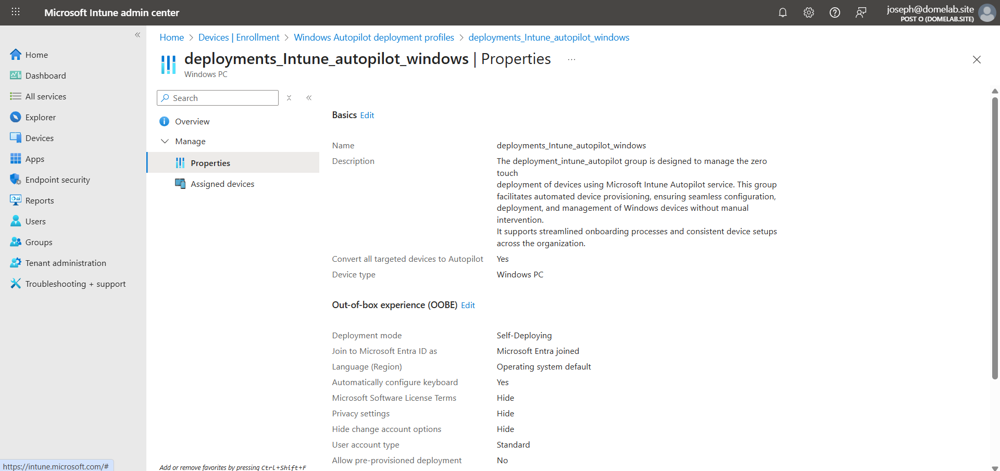
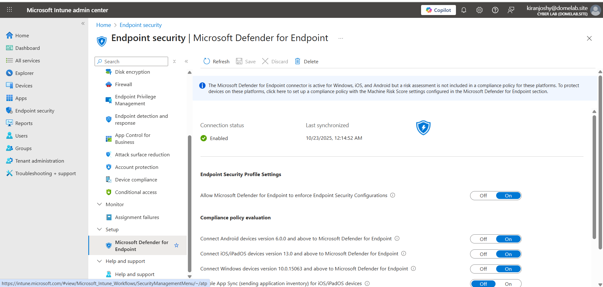
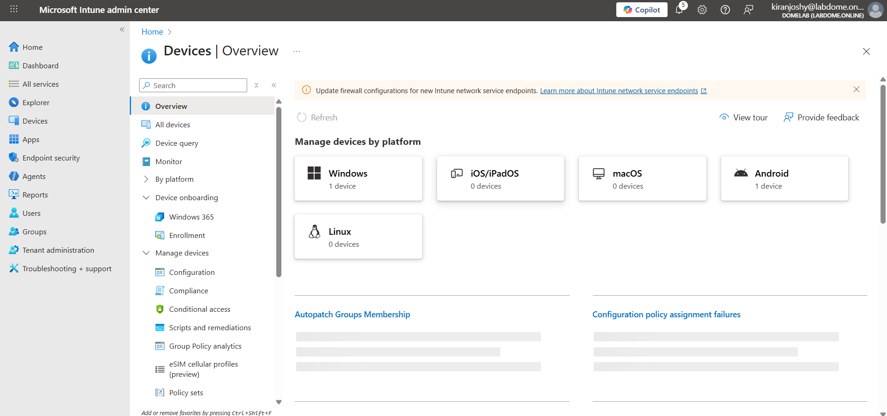

# 📘 Project 01 — Cloud-Centric Security Lab with SOC Integration

---

## Project Overview

This project documents my **hands-on experience designing, securing, monitoring, and automating a cloud-centric enterprise environment** using Microsoft security technologies and Infrastructure as Code (IaC).

The lab was intentionally designed to mirror how **real-world organizations operate a Security Operations Center (SOC)**, with a strong emphasis on:

- Identity-first and Zero Trust security
- Endpoint, email, and SaaS protection
- Centralized logging and visibility
- Threat detection and investigation
- Automated incident response (SOAR)

Rather than listing configurations alone, this project focuses on:

- **Why** each security control exists  
- **How** Microsoft security services integrate end-to-end  
- **How** attacks are detected, enriched, visualized, and automatically contained  

This reflects structured learning, deliberate design decisions, and operational thinking aligned with **SOC Analyst, Cloud Security, and Junior Security Engineer roles**.

---

## Key Outcomes

- Deployed Microsoft Sentinel and Log Analytics using **Terraform (IaC)**
- Centralized identity, endpoint, email, and cloud telemetry
- Detected real-world **RDP brute-force attacks** (Event ID 4625)
- Enriched logs with **GeoIP intelligence** and visualized attacker locations
- Automated incident containment using **SOAR (Logic Apps + Runbooks)**

---

## Technologies Used

- **Cloud Platform:** Microsoft Azure  
- **Identity & Access Management:** Microsoft Entra ID (Azure AD)  
- **Device Management:** Microsoft Intune (Windows & Android)  
- **Threat Protection:** Microsoft Defender Suite  
- **SIEM / SOAR:** Microsoft Sentinel  
- **Infrastructure as Code:** Terraform (GitHub + Terraform Cloud)  
- **DNS & Zero Trust Foundation:** Cloudflare  

---

## Lab Completion Checklist

- [x] Custom domain and DNS configuration  
- [x] Secure Microsoft 365 tenant setup  
- [x] Automated licensing and dynamic groups  
- [x] Windows Autopilot onboarding  
- [x] CIS-aligned endpoint security baselines  
- [x] Endpoint Detection & Response (EDR/XDR)  
- [x] Mobile security (Android BYOD)  
- [x] Email and SaaS protection  
- [x] Conditional Access (Zero Trust)  
- [x] SIEM, SOAR, and automated incident response  

---

## Implementation Journey

---

## Step 1: Domain Purchase & DNS Foundation (Cloudflare)

### 🔍 Overview
Established a secure DNS foundation to support identity, email, and Zero Trust services.

### 🛠️ What I Did
- Purchased a custom domain
- Transferred DNS management to Cloudflare
- Verified nameserver propagation

### 📚 What I Learned
- DNS is foundational to cloud identity and email security
- Why Cloudflare is commonly used in Zero Trust architectures

### 🧠 Skills Demonstrated
- DNS configuration
- Third-party integration

.jpg)

---

## Step 2: Secure Microsoft 365 Tenant Foundation with Custom Domain, Cloudflare DNS & Enterprise Licensing**

### 🔍 Overview  
Built a security-first Microsoft 365 tenant by integrating a custom domain, enforcing strong identity controls, configuring Cloudflare-managed DNS, and enabling enterprise-grade security through strategic licensing.

This step established the core identity, email, collaboration, and device-management foundation required for all downstream security, endpoint, and SIEM integrations.

### 🛠️ What I Did  

#### Tenant & Identity Foundation
- Created a new Microsoft 365 tenant backed by **Microsoft Entra ID**
- Enforced **MFA** for administrative accounts during tenant onboarding

#### Custom Domain & DNS Integration
- Added and verified a custom domain using DNS-based validation
- Migrated DNS management to **Cloudflare**
- Used Cloudflare’s Microsoft 365 integration for domain authorization
- Configured and validated DNS records for:
  - Exchange Online  
  - SharePoint Online  
  - Microsoft Teams  
  - Microsoft Intune  
- Ensured correct record types and disabled proxying where required

#### Licensing & Security Enablement
- Activated trial licenses to unlock enterprise security capabilities:
  - Microsoft 365 Business Premium  
  - Enterprise Mobility + Security (EMS) E5  
  - Microsoft Defender for Endpoint (Plan 2)  
  - Microsoft Defender for Office 365 (Plan 2)  
  - Microsoft 365 E5 (security workloads)  
- Aligned licensing with security requirements including EDR, XDR, MDM, and email protection
- Verified license readiness for Intune, Defender, and Sentinel integrations

### 📚 What I Learned  
- Early identity, DNS, and licensing decisions define Microsoft 365 security posture  
- Enforcing MFA from day one significantly reduces administrative risk  
- Cloudflare simplifies and strengthens Microsoft 365 domain management  
- Microsoft security capabilities are license-driven, not configuration-only  
- Proper DNS configuration is critical for email flow, trust, and device management  

### 🧠 Skills Demonstrated  
- Microsoft Entra ID administration  
- Secure Microsoft 365 tenant onboarding  
- MFA enforcement and identity hardening  
- Custom domain and Cloudflare DNS management  
- Microsoft 365 service DNS configuration  
- Enterprise licensing strategy and security enablement  

%20-%20Copy.png)

---

## Step 3: Identity Automation with Dynamic Groups, Auto-Licensing & Break-Glass Access**

### 🔍 Overview  
Implemented scalable identity automation using dynamic Microsoft Entra ID groups, enabling automatic license assignment and secure emergency access.

---

### 🛠️ What I Did  
- Created dynamic **user** and **device** security groups for automated governance  
- Designed groups to support licensing, Intune policies, Conditional Access, and Autopilot  
- Configured **group-based licensing** to automatically assign security and productivity licenses  
- Ensured new users receive Intune, Defender, and collaboration access by default  
- Created a **Global Administrator break-glass account** and excluded it from Conditional Access to prevent tenant lockout  

### 📚 What I Learned  
- Dynamic groups improve scalability and consistency  
- Group-based licensing reduces operational risk  
- Break-glass accounts are essential for tenant resilience  

### 🧠 Skills Demonstrated  
- Microsoft Entra ID dynamic groups  
- Identity automation and access governance  
- Group-based licensing  
- Break-glass account design  

### ✅ Why This Step Matters  
This step converted the tenant into an **automated, policy-driven identity platform**, ensuring secure onboarding while preserving emergency access.

%20-%20Copy.jpg)

---

## Step 4: Intune Enrollment & Windows Autopilot Configuration

### 🔍 Overview
Secured endpoints from first boot using Intune and Autopilot.

### 🛠️ What I Did
- Enabled automatic Intune enrollment
- Created Autopilot deployment profile
- Validated compliance and policy application

### 📚 What I Learned
- Device security begins at enrollment
- Licensing impacts endpoint workflows

### 🧠 Skills Demonstrated
- Endpoint provisioning
- Windows Autopilot

---

## Step 5: CIS Security Baselines & Endpoint Hardening

### 🔍 Overview
Hardened endpoints using CIS-aligned security baselines.

### 🛠️ What I Did
- Deployed antivirus, firewall, encryption, ASR, and compliance policies

### 📚 What I Learned
- Baselines reduce configuration drift
- Differences between user and device enforcement

### 🧠 Skills Demonstrated
- Endpoint hardening
- Policy management

%20-%20Copy.jpg)

---
## Step 6: Defender for Endpoint & XDR Integration

### 🔍 Overview
Enabled endpoint detection and response and validated XDR telemetry.

### 🛠️ What I Did
- Integrated Defender for Endpoint with Intune
- Enabled EDR, tamper protection, and live response
- Verified endpoint protection status

### 📚 What I Learned
- Endpoint telemetry strengthens XDR investigations
- How Intune and Defender integrate for enforcement and visibility

### 🧠 Skills Demonstrated
- Endpoint security
- Security tool integration

---

## Step 7: Windows Enterprise Endpoint Onboarding & Intune Validation**

### 🔍 Overview  
Onboarded and secured a Microsoft-provided Windows Enterprise device using Microsoft Intune to validate endpoint management and security enforcement.

### 🛠️ What I Did  
- Onboarded a **Windows Enterprise–licensed device** into Microsoft Intune  
- Verified successful enrollment and visibility under Windows endpoints  
- Confirmed application of:
  - CIS-aligned security baselines  
  - Compliance and configuration policies  
  - Microsoft Defender for Endpoint protection  
- Validated device compliance and security posture in Intune  

### 🧠 Skills Demonstrated  
- Windows Enterprise endpoint management  
- Microsoft Intune device onboarding  
- Endpoint compliance and security validation  

.png)

---

## Step 8: Android BYOD Onboarding with Intune & Work Profile Protection**

### 🔍 Overview  
Secured a personal Android device using Android Enterprise Work Profile to protect corporate data while preserving user privacy.

### 🛠️ What I Did  
- Onboarded a **personal Android device** into Intune using **Android Enterprise (Work Profile)**  
- Integrated **Managed Google Play** with Intune  
- Deployed corporate applications into the **Work profile**  
- Applied **App Protection (MAM) policies** to secure organizational data  
- Enforced access controls using **Conditional Access**  
- Validated separation between **personal and work apps**  

### 🧠 Skills Demonstrated  
- Android Enterprise (BYOD) configuration  
- App Protection (MAM) policy enforcement  
- Managed Google Play integration  
- Mobile Conditional Access enforcement  

  

  <em>Android Work Profile separating personal and corporate data</em>

  

  <em>Intune Device Onboarding Dashboard</em>

---

## Step 9: Microsoft Defender for Office 365 — Email Threat Protection

### 🔍 Overview
Strengthened email security against phishing and malware.

### 🛠️ What I Did
- Configured Defender for Office 365
- Enabled recommended presets
- Created custom phishing, malware, spam, Safe Links, and Safe Attachments policies

### 📚 What I Learned
- Email remains the most common attack vector
- Layered controls significantly reduce risk

### 🧠 Skills Demonstrated
- Email security administration
- Threat policy configuration

%20-%20Copy.jpg)
%20-%20Copy.jpg)
%20-%20Copy.jpg)
%20-%20Copy.jpg)

---

## Step 10: Microsoft Defender for Cloud Apps (CASB) & SaaS Security

### 🔍 Overview
Improved SaaS visibility and governance by leveraging Microsoft Defender for Cloud Apps to assess cloud application risk, identify shadow IT, and apply app-level access decisions.

This step focused on understanding CASB capabilities, licensing boundaries, and integration dependencies with Defender for Endpoint.

### 🛠️ What I Did
- Accessed the **Cloud App Catalog** to review Microsoft-assessed risk scores across SaaS applications
- Evaluated application security, compliance, and legal metadata
- Tagged selected applications as **Sanctioned** and **Unsanctioned**
- Validated Defender for Cloud Apps integration settings with **Microsoft Defender for Endpoint**
- Documented enforcement prerequisites and feature limitations within a trial environment

### ⚠️ Licensing & Environment Constraints
- Operated within a **trial / limited-license tenant**
- Full Cloud Discovery automation and enforcement require:
  - Microsoft 365 E5 or EMS E5
- Certain features (continuous discovery, automatic blocking, governance actions) were not fully available
- App tagging and catalog analysis remained accessible and functional

### 📚 What I Learned
- CASB provides centralized governance over SaaS usage and shadow IT
- Defender for Cloud Apps relies heavily on **Defender for Endpoint integration** for enforcement
- App states (Sanctioned / Unsanctioned / Monitored) directly influence access behavior
- Licensing determines **capability depth**, not just UI visibility
- CASB policies can automate security responses to risky user and app behavior

### 🧠 Skills Demonstrated
- CASB fundamentals (Microsoft Defender for Cloud Apps)
- SaaS risk assessment and governance
- Shadow IT visibility concepts
- Security feature licensing analysis
- Defender for Endpoint and CASB integration awareness

%20-%20Copy.jpg)
%20-%20Copy.jpg)
.png)

---

## Step 11: Conditional Access Enforcement & Zero Trust Alignment**

### 🔍 Overview  
Implemented identity-driven access controls aligned with Zero Trust principles by replacing Microsoft Security Defaults with staged, policy-based Conditional Access enforcement.

This step established granular, risk-aware access control across users, devices, and cloud applications while minimizing business disruption through report-only validation.

### 🛠️ What I Did  
- Disabled **Microsoft Security Defaults** to enable advanced Conditional Access customization  
- Imported **prebuilt Conditional Access base protection policies** from a GitHub repository and deployed them via **Microsoft Intune / Entra ID**  
- Reviewed and staged multiple baseline policies (200–209 series), including:
  - Require strong authentication
  - Block high-risk sign-ins
  - Enforce password changes for risky users
  - Require trusted or compliant devices
- Created a **custom Conditional Access policy** tailored to lab-specific data protection requirements  
- Configured all policies in **report-only mode** to safely evaluate impact before enforcement  
- Validated policy behavior using **Conditional Access insights and sign-in logs**  
- Explicitly excluded emergency / break-glass accounts to prevent administrative lockout  

### 📚 What I Learned  
- Conditional Access is a core Zero Trust control that enforces access based on **identity, risk, device posture, and context**  
- Disabling Security Defaults is required to implement granular Conditional Access strategies  
- Importing proven baseline policies accelerates secure deployment while reducing configuration errors  
- Report-only mode is critical for safely testing identity controls in production-like environments  
- Proper exclusions are essential to avoid accidental tenant lockouts  

### 🧠 Skills Demonstrated  
- Microsoft Entra ID Conditional Access administration  
- Zero Trust identity and access control design  
- Conditional Access policy staging and validation  
- Secure baseline policy adoption from GitHub  
- Custom policy creation and risk-based enforcement  
- Identity security troubleshooting and audit analysis  

%20-%20Copy.png)
%20-%20Copy.png)

---

## Step 12: Terraform Setup & Azure Authentication Preparation

🔍 **Overview**  
Prepared the local and cloud-based Terraform workflow required to deploy Microsoft Sentinel using Infrastructure as Code.

This step focused on tooling setup, repository preparation, and configuring Azure authentication required for Terraform execution.

🛠️ **What I Did**

Installed required tooling  
  - Git  
  - Visual Studio Code  

Cloned the GitHub repository  
  - Reviewed Terraform configuration files  
  - Extracted and copied provided IaC files into the repository  

Prepared Terraform Cloud  
  - Created a Terraform Cloud workspace  
  - Identified required Azure credentials for deployment  

Configured Azure Entra ID authentication  
  - Created an App Registration  
  - Collected Tenant ID and Client ID  
  - Generated a Client Secret  
  - Assigned Contributor RBAC role at the subscription scope  

📚 **What I Learned**
- Terraform Cloud requires Azure service principal authentication
- IaC workflows combine local tooling, source control, and cloud execution
- Identity configuration is a prerequisite for Terraform execution

🧠 **Skills Demonstrated**
- Git and GitHub workflows  
- Terraform Cloud setup  
- Azure Entra ID app registrations  
- Secure automation authentication

%20-%20Copy.png)
%20-%20Copy.jpg)
%20-%20Copy.jpg)
%20-%20Copy.jpg)
%20-%20Copy.jpg)
%20-%20Copy.jpg)

---

## Step 13: Terraform Cloud Workspace Setup & Variable Configuration**

### 🔍 Overview  
Prepared Terraform Cloud to execute the Sentinel Infrastructure-as-Code deployment by configuring the workspace, connecting it to the GitHub repository, and defining required environment variables.

This step ensured the Terraform workflow could run successfully before any resources were deployed.

### 🛠️ What I Did  
- Created a **Terraform Cloud workspace** for the Sentinel deployment  
- Connected the workspace to the **GitHub repository** containing the Terraform code  
- Configured required Terraform variables, including:
  - Azure subscription ID  
  - Tenant ID  
  - Client ID  
  - Client secret  
- Verified variable values matched the Azure environment  
- Confirmed the workspace was ready for **Terraform plan and apply** execution  

### 📚 What I Learned  
- Terraform Cloud requires explicit environment variables to authenticate with Azure  
- Proper workspace configuration is mandatory before executing IaC pipelines  
- Separating code from variables improves security and reusability  

### 🧠 Skills Demonstrated  
- Terraform Cloud workspace management  
- Secure variable handling for IaC  
- Infrastructure deployment readiness validation  

---

%20-%20Copy.jpg)

---

## Step 15: Sentinel Log Ingestion & Security Connector Enablement

🔍 Overview  
Prepared Microsoft Sentinel to ingest security telemetry by enabling core data connectors and integrating Microsoft security services.

This step established Sentinel as the centralized SIEM/XDR platform before onboarding any compute workloads.

🛠️ What I Did  
- Navigated to Microsoft Sentinel → Content Hub  
- Installed and configured Windows Security Events using Azure Monitor Agent (AMA)  
- Prepared Sentinel for platform-managed Data Collection Rules (DCRs)  
- Enabled integrations with Microsoft security services, including:
  - Microsoft Defender for Endpoint
  - Microsoft Defender XDR
  - Microsoft Defender for Office 365
  - Microsoft Defender for Cloud
  - Microsoft Defender for Cloud Apps
  - Microsoft Entra ID & Entra ID Protection
  - Microsoft 365  
- Verified connector configuration and ingestion readiness prior to VM deployment  

📚 What I Learned  
- Sentinel aggregates telemetry across Microsoft’s security ecosystem  
- AMA simplifies log onboarding using managed DCRs  
- Enabling connectors early prevents telemetry gaps during attacks  

🧠 Skills Demonstrated  
- Microsoft Sentinel connector configuration  
- SIEM & XDR integration design  
- Log ingestion architecture  
- Azure Monitor Agent (AMA) fundamentals  

---
EVDCE

---

## Step 16: Attack Surface Creation & Log Generation (Windows VM)**

### 🔍 Overview  
Deployed and intentionally exposed a Windows virtual machine to simulate real-world attack behavior and generate authentic security telemetry for Sentinel analysis.

This step created the conditions required to observe brute-force activity and validate end-to-end log ingestion.

### 🛠️ What I Did  
- Deployed a **Windows virtual machine** in Azure (VM creation performed in earlier step)
- Retrieved the VM’s **public IP address**
- Modified the **Network Security Group (NSG)** to:
  - Remove restrictive inbound rules
  - Allow inbound traffic from any source (lab-only, intentional exposure)
- Connected to the VM using **Remote Desktop Protocol (RDP)**
- Disabled the **Windows Defender Firewall** inside the VM to maximize visibility
- Simulated brute-force behavior by:
  - Attempting multiple failed RDP logins using a non-existent username (e.g., `employee`)
- Logged in successfully with valid credentials after failed attempts
- Verified local security logging by inspecting:
  - **Windows Event Viewer → Security logs**
  - Confirmed **Event ID 4625** (failed logon attempts)

### 📚 What I Learned  
- Exposed services are rapidly discovered and attacked on the public internet  
- Failed authentication attempts generate high-value security events  
- Event Viewer provides raw telemetry before SIEM ingestion  
- Attack simulation is essential to validate logging pipelines  

### 🧠 Skills Demonstrated  
- Azure virtual machine administration  
- Network Security Group (NSG) configuration  
- Windows security logging analysis  
- Attack simulation and telemetry generation  
- SOC-style validation of attack surface exposure  

%20-%20Copy.png)

---

## Step 17: Threat Detection, GeoIP Enrichment & Attack Visualization (Microsoft Sentinel)**

### 🔍 Overview  
Enabled threat detection and enriched attack telemetry in Microsoft Sentinel to identify, analyze, and visualize real-world brute-force activity against an exposed Windows virtual machine.

This step transformed raw security logs into actionable intelligence using KQL, watchlists, and visual workbooks.

### 🛠️ What I Did  

#### Detection & Log Validation
- Queried **SecurityEvent** logs in the Log Analytics Workspace
- Filtered failed authentication attempts using **Event ID 4625**
- Confirmed Sentinel was ingesting real attack data from the VM
- Validated attacker IP addresses and timestamps using KQL

#### GeoIP Enrichment
- Downloaded and imported a **GeoIP CSV** as a Sentinel **Watchlist**
- Configured watchlist settings:
  - Alias: `geoip`
  - Search key: `network`
- Enriched security logs by correlating attacker IPs with geographic data
- Verified enriched fields including:
  - Country
  - City
  - Latitude & longitude

#### Attack Visualization
- Created a custom **Microsoft Sentinel Workbook**
- Removed default widgets and added a **Query-based visualization**
- Used advanced KQL to:
  - Aggregate failed RDP attempts
  - Group attackers by geographic location
- Rendered a **global attack map** showing:
  - Attack origin countries
  - Relative attack volume
- Reviewed map configuration and query logic for accuracy

### 📚 What I Learned  
- Raw security logs gain value through enrichment and context  
- Watchlists enable powerful correlations without external services  
- KQL is essential for SOC-level threat analysis  
- Visualization improves detection clarity and executive communication  

### 🧠 Skills Demonstrated  
- Microsoft Sentinel threat detection  
- KQL querying and log analysis  
- GeoIP enrichment using watchlists  
- SIEM data visualization and dashboards  
- Security operations (SOC) workflow fundamentals  

---

EVDCE

---

## Project Summary
This project demonstrates my ability to **design, secure, monitor, detect, enrich, visualize, and automate** security operations in a modern cloud environment.

It showcases:
- Identity-first security
- Endpoint and email protection
- Centralized logging and SIEM operations
- Threat detection and GeoIP enrichment
- Automated SOAR-based incident response

---

## Why This Project Matters
This project reflects my readiness for **SOC Analyst, Cloud Security, and Junior Security Engineer roles**.

It demonstrates:
- Practical hands-on execution  
- Security reasoning and design thinking  
- Clear documentation and communication  
- A strong operational mindset aligned with real-world security teams  

 GeoIP 

%20-%20Copy.jpg)
%20-%20Copy.jpg)
%20-%20Copy.jpg)
%20-%20Copy.jpg)
%20-%20Copy.jpg)

---

SOAR Playbooks & Automated Incident Response

### 🔍 Overview
Automated incident containment using SOAR.

### 🛠️ What I Did
- Built Logic App playbook
- Triggered Azure Automation Runbook
- Blocked attacker IP using NSG rules

%20-%20Copy.jpg)
%20-%20Copy.jpg)
%20-%20Copy.jpg)
%20-%20Copy.jpg)
%20-%20Copy.jpg)
%20-%20Copy.jpg)
%20-%20Copy.jpg)
%20-%20Copy.jpg)

---

12

%20-%20Copy.jpg)
%20-%20Copy.jpg)
%20-%20Copy.jpg)
%20-%20Copy.jpg)
%20-%20Copy.jpg)

13
%20-%20Copy.jpg)
%20-%20Copy.jpg)
%20-%20Copy.jpg)
%20-%20Copy.jpg)
%20-%20Copy.jpg)
%20-%20Copy.jpg)

